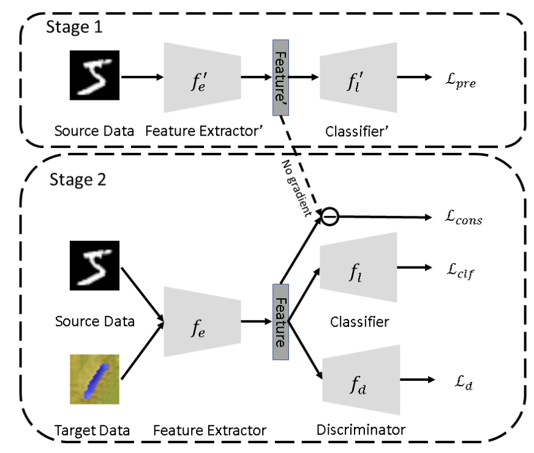

# Domain-Adaptation-GAN


This is my personal implementation of the [Domain Adaptation GAN](https://arxiv.org/abs/2001.02015)


### **Setup**
To set up the environment, follow these steps:<br>
1) ```conda create --name env pip```<br>
2) ```conda activate env```<br>
3) ```pip install -r requirements.txt```<br>

### **Usage**
In order to use the model, open the notebooks ```run_domain_adapation_gan.ipynb```.
The datasat preprocessing is copyied from the DANN experiment. If you want to replicate the training, please download the dataset from this link: https://github.com/sghoshjr/tf-dann/releases/download/v1.0.0/mnistm.h5 and set the variable: ```MNIST_M_PATH```